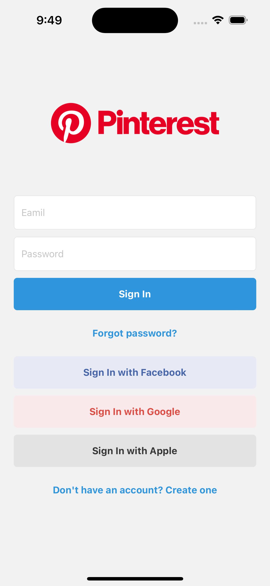
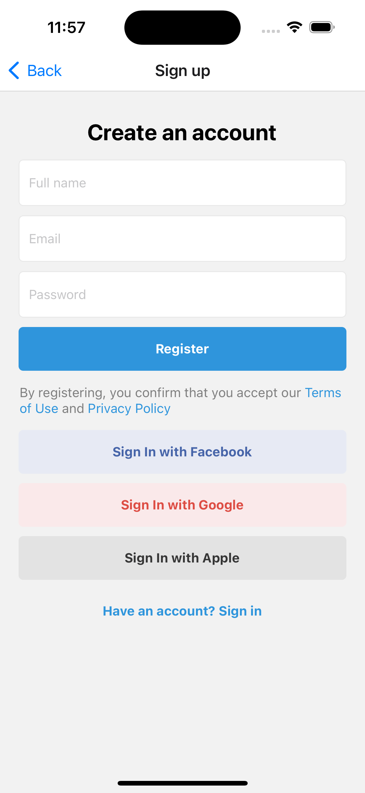
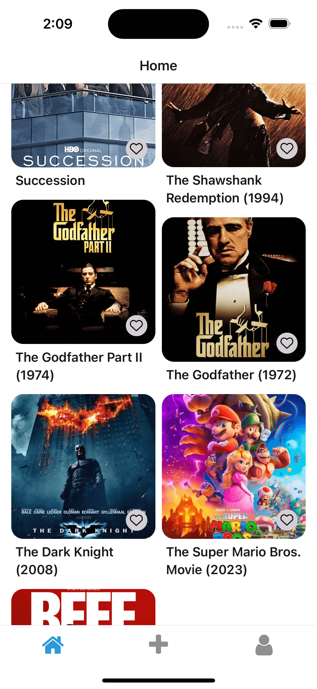
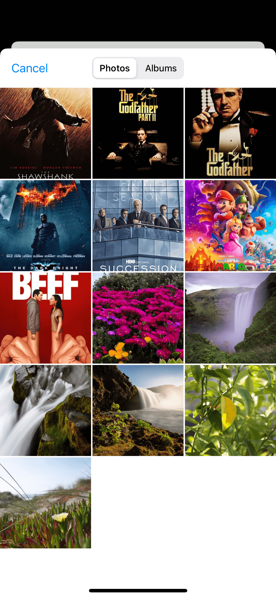
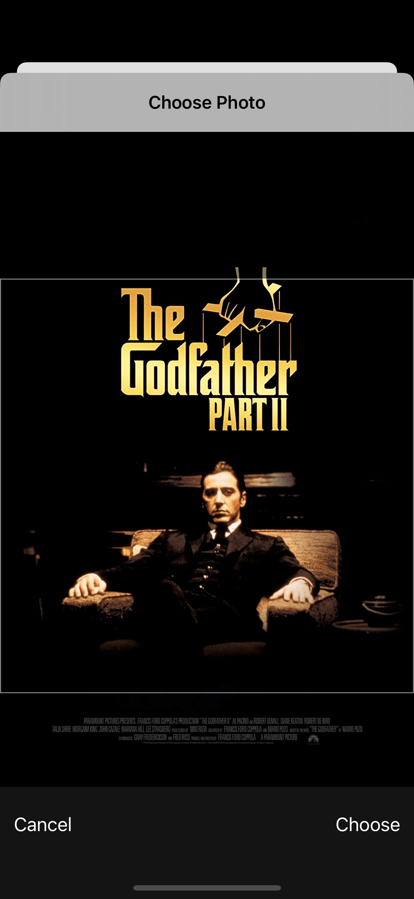
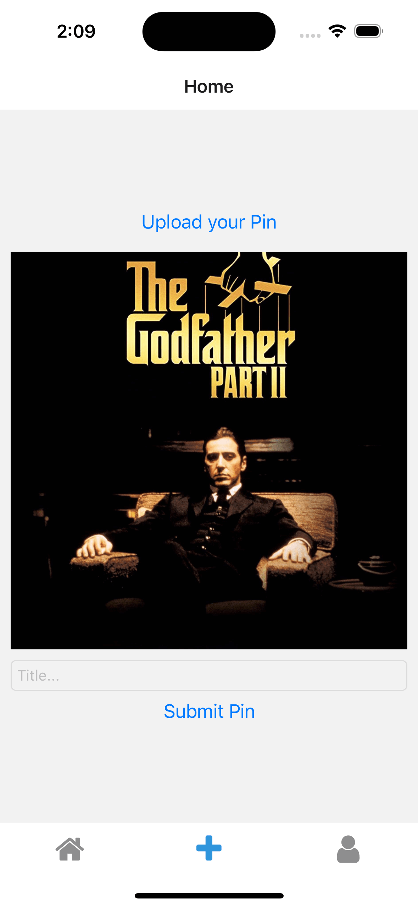
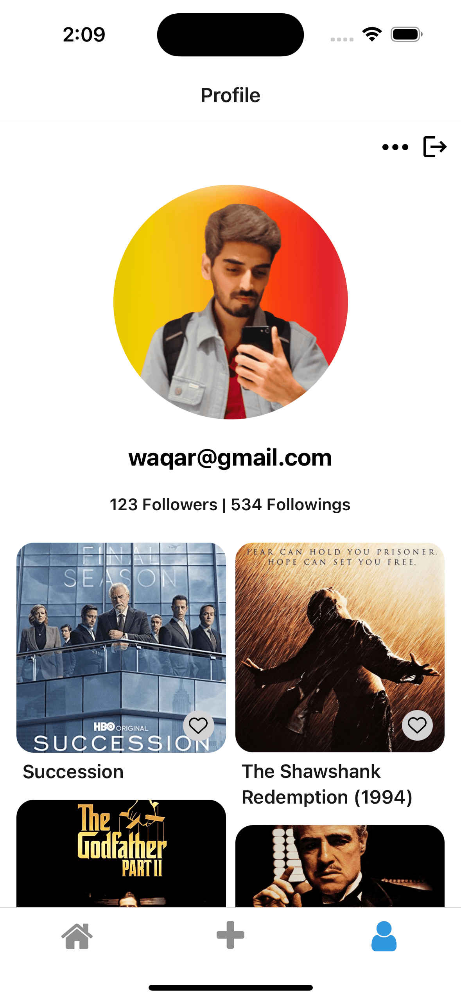
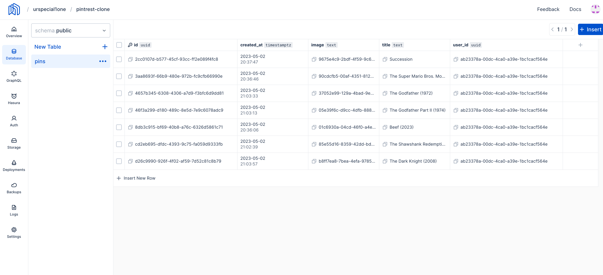
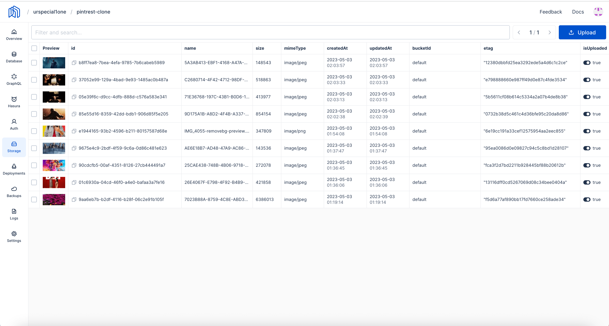

# Clone of Pinterest

## step

1. use `npx create-expo-app -t expo-template-blank-typescript` this will init the project in typescript
2. add the web support `npx expo install react-dom react-native-web @expo/webpack-config`

3. add secure store
   `npx expo install expo-secure-store`

4. we are going to use nHost so we add it in the project
   `yarn add @nhost/react`

5. add react native dotenv to project `yarn add react-native-dotenv`
6. go to babel.config.js add

```
    plugins: [ [ "module:react-native-dotenv", { moduleName: "@env", path: ".env", }, ], ],
```

7. create .env file and save the key there
   `touch .env`

8. add this to the .env file

   ```
   REACT_APP_NHOST_SUBDOMAIN=[subdomain]
   REACT_APP_NHOST_REGION=[region]
   ```

9. add the splash-screen `npx expo install expo-splash-screen`

10. add React Navigation both native and stack
    `yarn add @react-navigation/native @react-navigation/stack @react-navigation/native-stack @react-navigation/bottom-tabs`

11. add expo react navigation decencies and add gesture handle`npx expo install react-native-screens react-native-safe-area-context react-native-gesture-handler`

12. add expo-linking
    `npx expo install expo-linking`

13. add image picker
    `npx expo install expo-image-picker`

# preview

| Login                        | SignUp                       | Home                         |
| ---------------------------- | ---------------------------- | ---------------------------- |
|  |  |  |
|  |  |  |
|  |

| Pins                         | Images                       |
| ---------------------------- | ---------------------------- |
|  |  |
